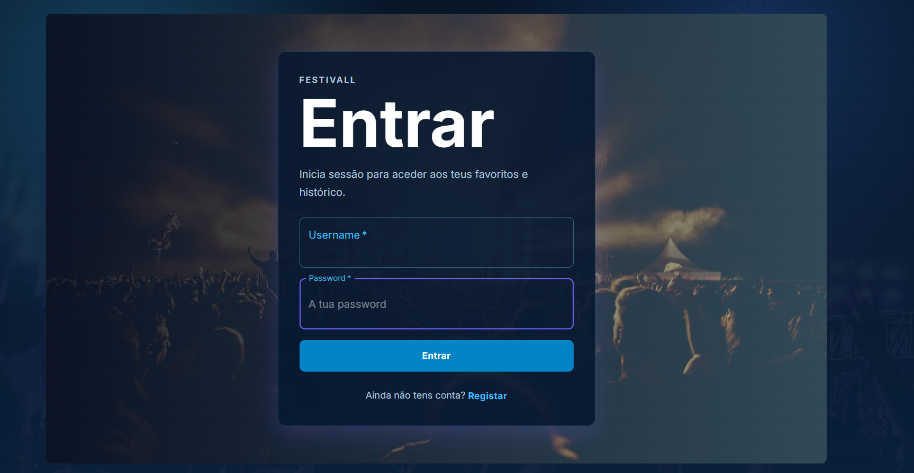
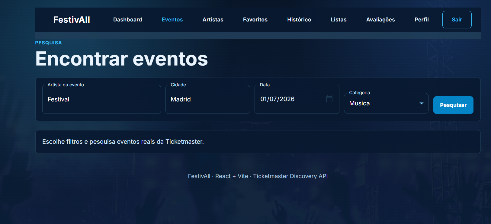
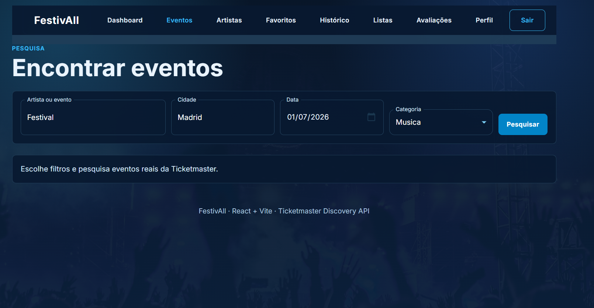

# M2
Repositório do trabalho prático **M2** desenvolvido no âmbito da unidade curricular **Desenvolvimento Web II**, do 2º ano do curso de Engenharia Informática da **UMAIA** (ano letivo 2025-26).

---
## Descrição do tema

**FestivAll** é uma Aplicação Web Cliente desenvolvida em **ReactJS** que consome a **Ticketmaster Discovery API** para disponibilizar uma plataforma de pesquisa e descoberta de eventos culturais e desportivos. A aplicação permite ao utilizador autenticar-se com uma Consumer Key da Ticketmaster, pesquisar eventos por palavra-chave, cidade, data e categoria, consultar detalhes de eventos e artistas, e guardar favoritos com persistência local.

A aplicação é totalmente containerizada com **Docker** (build multistage Node + Nginx) e foi construída com **Vite**, **Material UI**, **React Router** e **Framer Motion**.

---
## Organização do repositório

* O **código-fonte** está na pasta [`src/`](src/).
* Os **capítulos do relatório** estão na pasta [`doc/`](doc/).
* O **Dockerfile**, **docker-compose.yml** e **nginx.conf** estão na raiz do repositório.
* O **template do ficheiro de ambiente** está em [`.env.example`](.env.example).

---
## Galeria

| | | |
|:---:|:---:|:---:|
|  |  |  |
| Login com Consumer Key | Dashboard com eventos | Pesquisa de eventos |

---
## Tecnologias

* [React](https://react.dev/) (v18) — biblioteca para interfaces de utilizador
* [Vite](https://vitejs.dev/) (v5) — build tool e dev server
* [React Router](https://reactrouter.com/) (v6) — navegação SPA
* [Material UI](https://mui.com/) (v5) — biblioteca de componentes
* [Framer Motion](https://www.framer.com/motion/) (v11) — animações declarativas
* [Docker](https://www.docker.com/) — containerização
* [Nginx](https://nginx.org/) (Alpine) — servidor web em produção

### API consumida
* [Ticketmaster Discovery API v2](https://developer.ticketmaster.com/) — eventos culturais e desportivos

### Ferramentas auxiliares
* [Node.js](https://nodejs.org/) (v20+) — ambiente de execução para o build
* [GitHub](https://github.com/) — controlo de versões
* [DockerHub](https://hub.docker.com/) — distribuição da imagem
* [Visual Studio Code](https://code.visualstudio.com/) — editor

---
## Como executar

### Pré-requisitos
* Conta no [portal de developers da Ticketmaster](https://developer.ticketmaster.com/) para obter Consumer Key
* Docker e Docker Compose instalados (ou Node.js 20+ para execução local)

### Configuração
Criar ficheiro `.env` na raiz a partir do `.env.example`:
```
VITE_TM_API_KEY=a_tua_consumer_key
```

### Execução com Docker
```bash
docker compose up --build
# Aceder em http://localhost:3000
```

### Execução local
```bash
npm install
npm run dev
# Aceder em http://localhost:5173
```

---
## Relatório

* Capítulo 1: [Apresentação do projeto](doc/c1.md)
* Capítulo 2: [Recursos](doc/c2.md)
* Capítulo 3: [Produto](doc/c3.md)
* Capítulo 4: [Apresentação](doc/c4.md)

---
## Imagens Docker no Docker Hub

* `[username]/festivall:latest` — [link a adicionar]

---
## Autores

| Nome | GitHub |
|------|--------|
| **Marcelo Pinto** | https://github.com/MarceloCostaOBJ |
| **[Nome do colega]** | https://github.com/[username] |

---
